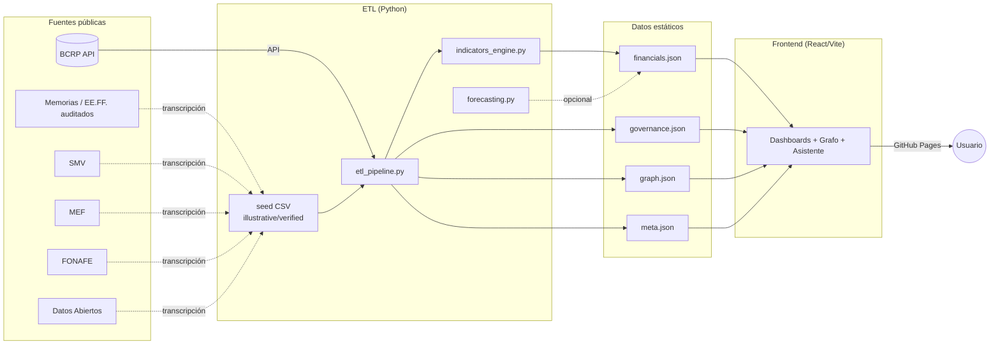
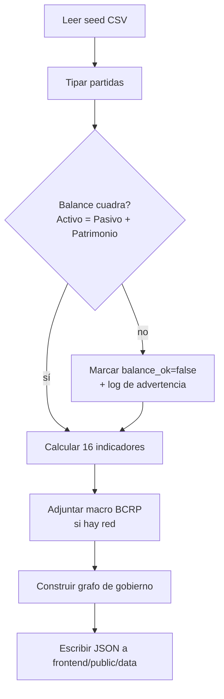
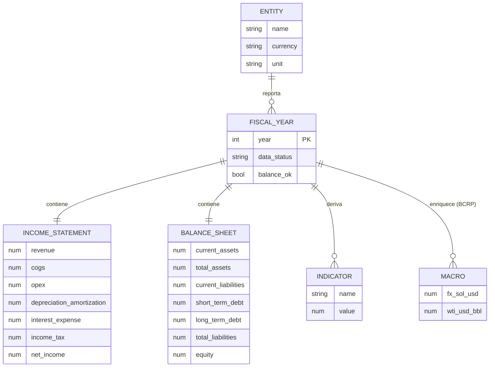
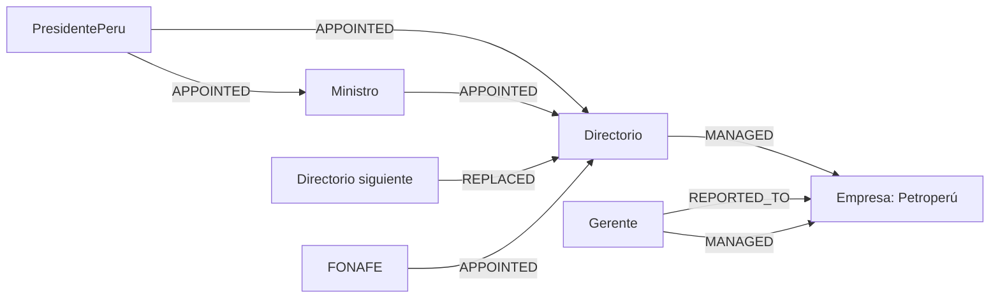
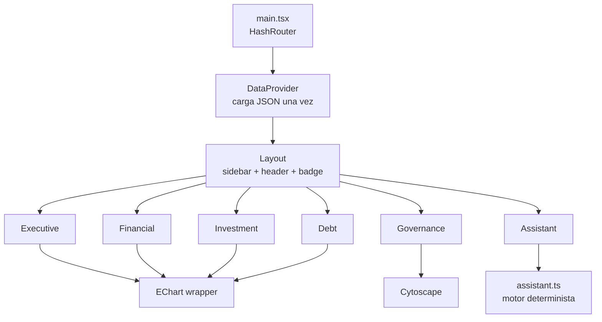

# Arquitectura — Petroperú Analytics

Plataforma **100% estática** (sin backend): el procesamiento ocurre *offline*/en CI y el
resultado es JSON servido por GitHub Pages. Esto la hace gratuita, reproducible y fácil de auditar.

## Vista de alto nivel

## Flujo de datos (ETL)

## Modelo ER (datos financieros)

## Modelo de grafo (gobierno corporativo)

Nodos: `PresidentePeru`, `Ministro`, `Directorio`, `Gerente`, `Empresa`.
Relaciones: `APPOINTED`, `REPORTED_TO`, `MANAGED`, `REPLACED`.
Materialización en Neo4j: ver `graph/model.cypher` y consultas en `graph/queries.cypher`.

## Componentes del frontend

## Decisiones de diseño

- **Sin backend**: máximo alcance público, costo cero, fácil auditoría. El precio es que los
  datos se regeneran por ETL, no en vivo.
- **HashRouter**: evita configuración de *rewrites* en GitHub Pages.
- **Separación cruda/derivada**: el CSV solo guarda partidas; los indicadores se calculan, así
  reemplazar datos no rompe la lógica.
- **Estado de datos como ciudadano de primera clase**: `data_status` viaja hasta la UI.
